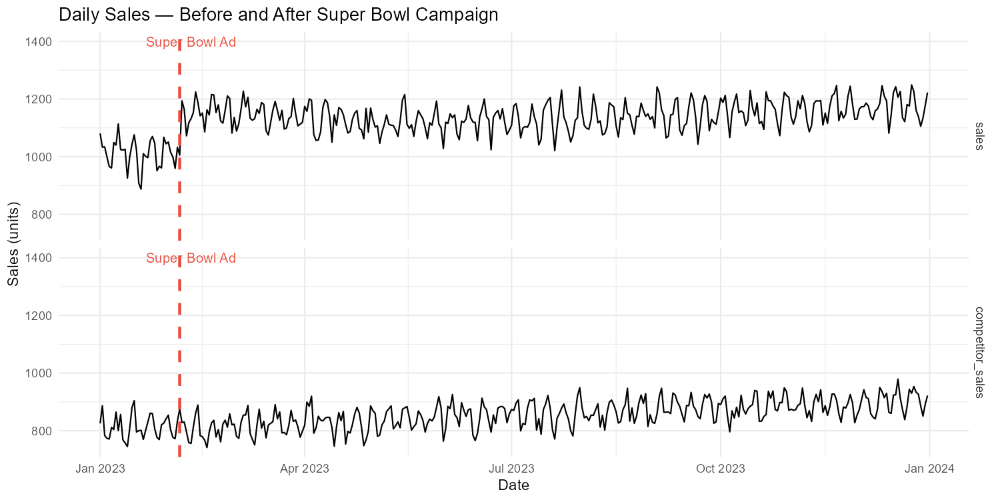
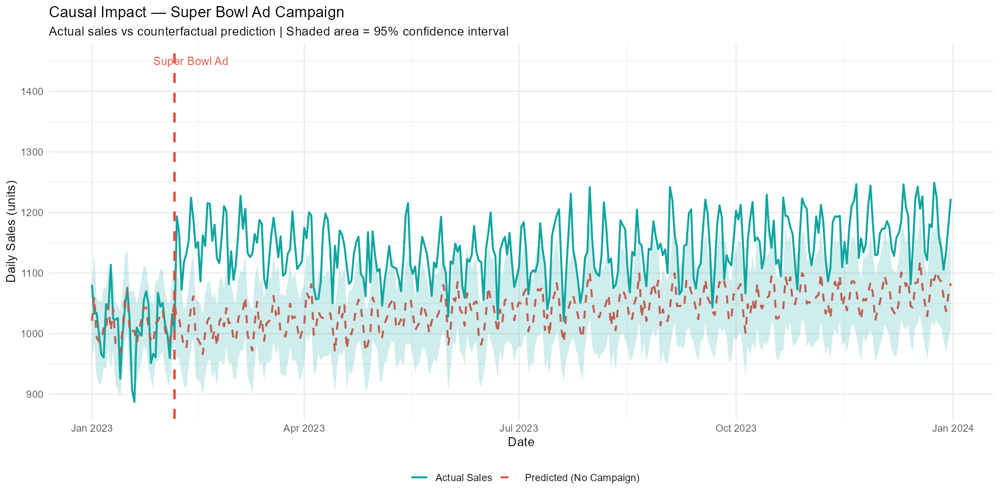
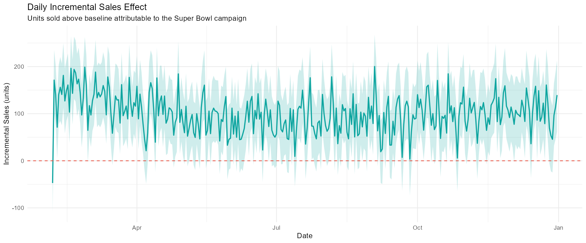
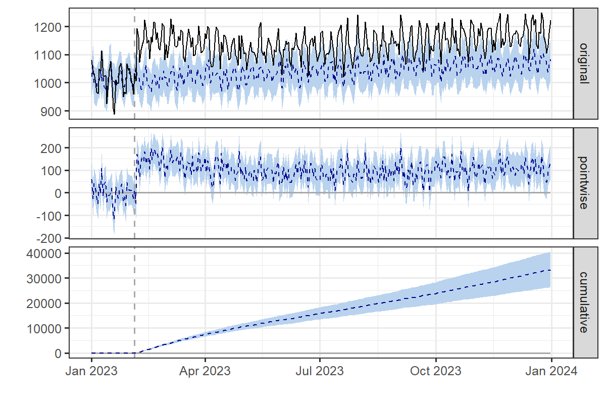

# Causal Impact Analysis — Measuring the Effect of a Super Bowl Ad Campaign on Sales

**Tools:** R (CausalImpact, tidyverse, zoo, ggplot2)  
**Skills:** Causal Inference, Bayesian Structural Time Series, Marketing Effectiveness, Statistical Hypothesis Testing  
**Method:** Google's CausalImpact Package | Counterfactual Analysis

---

##  Business Problem

One of the most fundamental — and most difficult — questions in marketing analytics is:

> *"Did our campaign actually cause a sales increase, or would sales have risen anyway?"*

A simple before-and-after comparison of sales is insufficient because external factors — seasonal trends, economic conditions, competitor activity — may have caused sales to rise regardless of the campaign. To isolate the **true causal effect** of a marketing intervention, we need a more rigorous approach.

This project applies **Causal Impact Analysis** using Google's CausalImpact R package to measure whether a Super Bowl advertising campaign caused a statistically significant lift in daily sales , controlling for market-wide trends using a competitor's sales as a control variable.

---

##  Methodology

### Causal Inference Framework

**CausalImpact** uses a **Bayesian Structural Time Series (BSTS)** model to construct a counterfactual — an estimate of what sales would have looked like had the campaign never run. The causal effect is then defined as the difference between actual observed sales and this counterfactual prediction.

The key insight is the use of a **control variable** — competitor sales — which captures market-wide trends (seasonality, economic conditions, broader consumer behaviour) that affect both brands simultaneously. Any divergence between actual sales and the model's prediction after the campaign launch must therefore be attributable to the campaign itself, not external factors.

### Statistical Hypothesis

**Null Hypothesis (H₀):**
> The Super Bowl ad campaign had no causal effect on sales. Any observed difference between actual and predicted post-campaign sales occurred by chance.

**Alternative Hypothesis (H₁):**
> The Super Bowl ad campaign caused a statistically significant change in sales that cannot be explained by chance or market-wide trends.

The model tests this by computing a **posterior probability** — the probability that the observed effect is real given the data. A p-value below 0.05 allows us to reject the null hypothesis.

### Why Competitor Sales as a Control Variable?

The control variable assumption is:
> *"Any external factor that would have affected our sales — seasonal trends, macroeconomic conditions, market sentiment — would also affect our competitor's sales proportionally."*

This means:
- If both our sales AND competitor sales rise after the campaign → likely a market trend, not our campaign
- If our sales rise while competitor sales remain flat → the divergence is caused by our campaign

This is the same logic used in **Difference-in-Differences** econometric models, a standard technique in causal inference research.

---

##  Data

- **Period:** January 1, 2023 – December 31, 2023 (365 daily observations)
- **Campaign event:** Super Bowl ad aired on February 5, 2023 (Day 37)
- **Pre-campaign period:** Jan 1 – Feb 4 (36 days) — used to train the model
- **Post-campaign period:** Feb 5 – Dec 31 (329 days) — period of interest

**Variables:**
- `sales` — daily units sold by the brand running the Super Bowl campaign
- `competitor_sales` — daily units sold by a competitor (control variable, unaffected by the campaign)

**Data structure:**
- Baseline sales include a slight upward trend, weekly seasonality, and random noise — reflecting realistic market conditions
- Campaign effect modeled as an initial lift of ~150 units that decays exponentially over time — consistent with empirical advertising carryover effects

---

## Results

### Model Output

| Metric | Value |
|---|---|
| **Actual avg daily sales (post-campaign)** | 1,143 units |
| **Predicted avg daily sales (no campaign)** | 1,042 units |
| **Absolute daily effect** | +101 units/day |
| **Relative sales lift** | +9.7% |
| **Total incremental sales** | ~33,229 units |
| **p-value** | 0.001 |
| **Statistically significant?** | Yes — at 99.9% confidence |

### Interpretation

With a p-value of 0.001, we **reject the null hypothesis** — there is only a 0.1% probability that the observed 9.7% sales lift occurred by chance. The CausalImpact model, controlling for competitor sales and market-wide trends, attributes the full incremental effect of ~101 units per day to the Super Bowl campaign.

---
## 📊 Visualizations

### Raw Sales Data — Before and After Campaign


### Actual vs Counterfactual Sales


### Daily Incremental Effect


### CausalImpact 3-Panel Output


##  Business Recommendations

**1. The campaign generated a statistically significant and economically meaningful sales lift**
A 9.7% daily sales increase sustained over 329 days generates approximately 33,229 incremental units. At an assumed revenue of $100 per unit, this represents **$3.3M in incremental revenue** attributable directly to the campaign.

**2. ROI Assessment**
If the Super Bowl campaign cost less than $3.3M in total media spend and production, it delivered a positive ROI. This framework can be applied to any campaign to calculate the exact ROI threshold.

**3. Advertising Carryover Effect**
The campaign effect decays exponentially over time — a realistic pattern known as the **Adstock effect** in marketing analytics. Future budget planning should account for this decay when estimating the long-term value of high-reach broadcast campaigns.

**4. Recommendation**
Continue investment in high-reach broadcast campaigns with sufficient pre-campaign baseline data to enable robust counterfactual modeling. Replicate this analysis across additional campaigns to build an evidence base for budget allocation decisions.

---

## Project Structure

```
causal-impact-super-bowl/
│
├── causal_impact_analysis.R         # Full analysis R script
├── README.md                        # Project documentation
├── raw_sales_data.png               # Raw sales time series with campaign marker
├── causal_impact_plot.png           # CausalImpact 3-panel output
├── actual_vs_counterfactual.png     # Actual vs predicted sales
└── incremental_effect.png           # Daily incremental sales effect
```

---

## How to Run

```r
# Install required packages
install.packages(c("CausalImpact", "zoo", "tidyverse"))

# Run the full analysis
source("causal_impact_analysis.R")
```

---

##  Skills Demonstrated

- **Causal inference** — distinguishing correlation from causation in marketing data
- **Bayesian structural time series** — Google's CausalImpact framework
- **Control variable selection** — competitor sales as market trend proxy
- **Statistical hypothesis testing** — null/alternative hypothesis, p-value interpretation
- **Marketing effectiveness measurement** — quantifying incremental ROI from campaigns
- **Adstock modeling** — exponential decay of advertising carryover effects
- **Data visualization** — ggplot2 counterfactual and effect plots
- **Business communication** — translating statistical findings into actionable recommendations

---

## Background Reading

- Brodersen et al. (2015). *Inferring causal impact using Bayesian structural time-series models.* Annals of Applied Statistics.
- Google CausalImpact R Package: https://google.github.io/CausalImpact/

---

*Sneha Ashok Rao | M.S. Quantitative Economics, UCLA*
